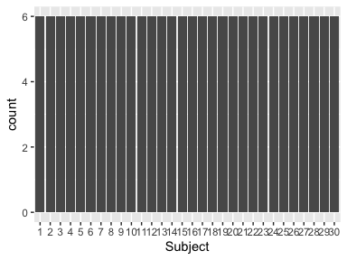
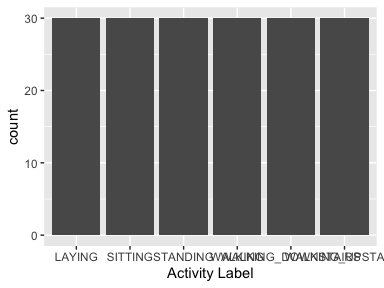

# Data report overview
The dataset examined has the following dimensions:

---------------------------------
Feature                    Result
------------------------ --------
Number of observations        180

Number of variables            68
---------------------------------

# Codebook summary table

----------------------------------------------------------------------------------------
Label   Variable                            Class       # unique  Missing  Description  
                                                          values                        
------- ----------------------------------- --------- ---------- --------- -------------
        **[Subject]**                       factor            30  0.00 %                

        **[Activity                         factor             6  0.00 %                
        Label]**                                                                        

        **[tBodyAcc-mean()-X]**             numeric          180  0.00 %                

        **[tBodyAcc-mean()-Y]**             numeric          180  0.00 %                

        **[tBodyAcc-mean()-Z]**             numeric          180  0.00 %                

        **[tBodyAcc-std()-X]**              numeric          180  0.00 %                

        **[tBodyAcc-std()-Y]**              numeric          180  0.00 %                

        **[tBodyAcc-std()-Z]**              numeric          180  0.00 %                

        **[tGravityAcc-mean()-X]**          numeric          180  0.00 %                

        **[tGravityAcc-mean()-Y]**          numeric          180  0.00 %                

        **[tGravityAcc-mean()-Z]**          numeric          180  0.00 %                

        **[tGravityAcc-std()-X]**           numeric          180  0.00 %                

        **[tGravityAcc-std()-Y]**           numeric          180  0.00 %                

        **[tGravityAcc-std()-Z]**           numeric          180  0.00 %                

        **[tBodyAccJerk-mean()-X]**         numeric          180  0.00 %                

        **[tBodyAccJerk-mean()-Y]**         numeric          180  0.00 %                

        **[tBodyAccJerk-mean()-Z]**         numeric          180  0.00 %                

        **[tBodyAccJerk-std()-X]**          numeric          180  0.00 %                

        **[tBodyAccJerk-std()-Y]**          numeric          180  0.00 %                

        **[tBodyAccJerk-std()-Z]**          numeric          180  0.00 %                

        **[tBodyGyro-mean()-X]**            numeric          180  0.00 %                

        **[tBodyGyro-mean()-Y]**            numeric          180  0.00 %                

        **[tBodyGyro-mean()-Z]**            numeric          180  0.00 %                

        **[tBodyGyro-std()-X]**             numeric          180  0.00 %                

        **[tBodyGyro-std()-Y]**             numeric          180  0.00 %                

        **[tBodyGyro-std()-Z]**             numeric          180  0.00 %                

        **[tBodyGyroJerk-mean()-X]**        numeric          180  0.00 %                

        **[tBodyGyroJerk-mean()-Y]**        numeric          180  0.00 %                

        **[tBodyGyroJerk-mean()-Z]**        numeric          180  0.00 %                

        **[tBodyGyroJerk-std()-X]**         numeric          180  0.00 %                

        **[tBodyGyroJerk-std()-Y]**         numeric          180  0.00 %                

        **[tBodyGyroJerk-std()-Z]**         numeric          180  0.00 %                

        **[tBodyAccMag-mean()]**            numeric          180  0.00 %                

        **[tBodyAccMag-std()]**             numeric          180  0.00 %                

        **[tGravityAccMag-mean()]**         numeric          180  0.00 %                

        **[tGravityAccMag-std()]**          numeric          180  0.00 %                

        **[tBodyAccJerkMag-mean()]**        numeric          180  0.00 %                

        **[tBodyAccJerkMag-std()]**         numeric          180  0.00 %                

        **[tBodyGyroMag-mean()]**           numeric          180  0.00 %                

        **[tBodyGyroMag-std()]**            numeric          180  0.00 %                

        **[tBodyGyroJerkMag-mean()]**       numeric          180  0.00 %                

        **[tBodyGyroJerkMag-std()]**        numeric          180  0.00 %                

        **[fBodyAcc-mean()-X]**             numeric          180  0.00 %                

        **[fBodyAcc-mean()-Y]**             numeric          180  0.00 %                

        **[fBodyAcc-mean()-Z]**             numeric          180  0.00 %                

        **[fBodyAcc-std()-X]**              numeric          180  0.00 %                

        **[fBodyAcc-std()-Y]**              numeric          180  0.00 %                

        **[fBodyAcc-std()-Z]**              numeric          180  0.00 %                

        **[fBodyAccJerk-mean()-X]**         numeric          180  0.00 %                

        **[fBodyAccJerk-mean()-Y]**         numeric          180  0.00 %                

        **[fBodyAccJerk-mean()-Z]**         numeric          180  0.00 %                

        **[fBodyAccJerk-std()-X]**          numeric          180  0.00 %                

        **[fBodyAccJerk-std()-Y]**          numeric          180  0.00 %                

        **[fBodyAccJerk-std()-Z]**          numeric          180  0.00 %                

        **[fBodyGyro-mean()-X]**            numeric          180  0.00 %                

        **[fBodyGyro-mean()-Y]**            numeric          180  0.00 %                

        **[fBodyGyro-mean()-Z]**            numeric          180  0.00 %                

        **[fBodyGyro-std()-X]**             numeric          180  0.00 %                

        **[fBodyGyro-std()-Y]**             numeric          180  0.00 %                

        **[fBodyGyro-std()-Z]**             numeric          180  0.00 %                

        **[fBodyAccMag-mean()]**            numeric          180  0.00 %                

        **[fBodyAccMag-std()]**             numeric          180  0.00 %                

        **[fBodyBodyAccJerkMag-mean()]**    numeric          180  0.00 %                

        **[fBodyBodyAccJerkMag-std()]**     numeric          180  0.00 %                

        **[fBodyBodyGyroMag-mean()]**       numeric          180  0.00 %                

        **[fBodyBodyGyroMag-std()]**        numeric          180  0.00 %                

        **[fBodyBodyGyroJerkMag-mean()]**   numeric          180  0.00 %                

        **[fBodyBodyGyroJerkMag-std()]**    numeric          180  0.00 %                
----------------------------------------------------------------------------------------

# Variable list
## Subject

\bminione

-----------------------------------
Feature                      Result
------------------------- ---------
Variable type                factor

Number of missing obs.      0 (0 %)

Number of unique values          30

Mode                            "1"

Reference category                1
-----------------------------------

\emini
\bminitwo
<!-- -->

\emini

- Observed factor levels: \"1\", \"10\", \"11\", \"12\", \"13\", \"14\", \"15\", \"16\", \"17\", \"18\", \"19\", \"2\", \"20\", \"21\", \"22\", \"23\", \"24\", \"25\", \"26\", \"27\", \"28\", \"29\", \"3\", \"30\", \"4\", \"5\", \"6\", \"7\", \"8\", \"9\". 

\fullline

## Activity Label

\bminione

------------------------------------
Feature                       Result
------------------------- ----------
Variable type                 factor

Number of missing obs.       0 (0 %)

Number of unique values            6

Mode                        "LAYING"

Reference category            LAYING
------------------------------------

\emini
\bminitwo
<!-- -->

\emini

- Observed factor levels: \"LAYING\", \"SITTING\", \"STANDING\", \"WALKING\", \"WALKING_DOWNSTAIRS\", \"WALKING_UPSTAIRS\". 

\fullline

## tBodyAcc-mean()-X

\bminione

--------------------------------------
Feature                         Result
------------------------- ------------
Variable type                  numeric

Number of missing obs.         0 (0 %)

Number of unique values            180

Median                            0.28

1st and 3rd quartiles       0.27; 0.28

Min. and max.                0.22; 0.3
--------------------------------------

\emini
\bminitwo
-X-1.png)<!-- -->

\emini

\fullline

## tBodyAcc-mean()-Y

\bminione

----------------------------------------
Feature                           Result
------------------------- --------------
Variable type                    numeric

Number of missing obs.           0 (0 %)

Number of unique values              180

Median                             -0.02

1st and 3rd quartiles       -0.02; -0.01

Min. and max.                   -0.04; 0
----------------------------------------

\emini
\bminitwo
-Y-1.png)<!-- -->

\emini

\fullline

## tBodyAcc-mean()-Z

\bminione

----------------------------------------
Feature                           Result
------------------------- --------------
Variable type                    numeric

Number of missing obs.           0 (0 %)

Number of unique values              180

Median                             -0.11

1st and 3rd quartiles        -0.11; -0.1

Min. and max.               -0.15; -0.08
----------------------------------------

\emini
\bminitwo
-Z-1.png)<!-- -->

\emini

\fullline

## tBodyAcc-std()-X

\bminione

---------------------------------------
Feature                          Result
------------------------- -------------
Variable type                   numeric

Number of missing obs.          0 (0 %)

Number of unique values             180

Median                            -0.75

1st and 3rd quartiles       -0.98; -0.2

Min. and max.                  -1; 0.63
---------------------------------------

\emini
\bminitwo
-X-1.png)<!-- -->

\emini

\fullline

## tBodyAcc-std()-Y

\bminione

----------------------------------------
Feature                           Result
------------------------- --------------
Variable type                    numeric

Number of missing obs.           0 (0 %)

Number of unique values              180

Median                             -0.51

1st and 3rd quartiles       -0.94; -0.03

Min. and max.                -0.99; 0.62
----------------------------------------

\emini
\bminitwo
-Y-1.png)<!-- -->

\emini

\fullline

## tBodyAcc-std()-Z

\bminione

----------------------------------------
Feature                           Result
------------------------- --------------
Variable type                    numeric

Number of missing obs.           0 (0 %)

Number of unique values              180

Median                             -0.65

1st and 3rd quartiles       -0.95; -0.23

Min. and max.                -0.99; 0.61
----------------------------------------

\emini
\bminitwo
-Z-1.png)<!-- -->

\emini

\fullline

## tGravityAcc-mean()-X

\bminione

---------------------------------------
Feature                          Result
------------------------- -------------
Variable type                   numeric

Number of missing obs.          0 (0 %)

Number of unique values             180

Median                             0.92

1st and 3rd quartiles        0.84; 0.94

Min. and max.               -0.68; 0.97
---------------------------------------

\emini
\bminitwo
-X-1.png)<!-- -->

\emini

\fullline

## tGravityAcc-mean()-Y

\bminione

---------------------------------------
Feature                          Result
------------------------- -------------
Variable type                   numeric

Number of missing obs.          0 (0 %)

Number of unique values             180

Median                            -0.13

1st and 3rd quartiles       -0.23; 0.09

Min. and max.               -0.48; 0.96
---------------------------------------

\emini
\bminitwo
-Y-1.png)<!-- -->

\emini

\fullline

## tGravityAcc-mean()-Z

\bminione

---------------------------------------
Feature                          Result
------------------------- -------------
Variable type                   numeric

Number of missing obs.          0 (0 %)

Number of unique values             180

Median                             0.02

1st and 3rd quartiles       -0.12; 0.15

Min. and max.                -0.5; 0.96
---------------------------------------

\emini
\bminitwo
-Z-1.png)<!-- -->

\emini

\fullline

## tGravityAcc-std()-X

\bminione

----------------------------------------
Feature                           Result
------------------------- --------------
Variable type                    numeric

Number of missing obs.           0 (0 %)

Number of unique values              180

Median                             -0.97

1st and 3rd quartiles       -0.98; -0.95

Min. and max.                  -1; -0.83
----------------------------------------

\emini
\bminitwo
-X-1.png)<!-- -->

\emini

\fullline

## tGravityAcc-std()-Y

\bminione

----------------------------------------
Feature                           Result
------------------------- --------------
Variable type                    numeric

Number of missing obs.           0 (0 %)

Number of unique values              180

Median                             -0.96

1st and 3rd quartiles       -0.97; -0.94

Min. and max.               -0.99; -0.64
----------------------------------------

\emini
\bminitwo
-Y-1.png)<!-- -->

\emini

\fullline

## tGravityAcc-std()-Z

\bminione

----------------------------------------
Feature                           Result
------------------------- --------------
Variable type                    numeric

Number of missing obs.           0 (0 %)

Number of unique values              180

Median                             -0.95

1st and 3rd quartiles       -0.96; -0.92

Min. and max.               -0.99; -0.61
----------------------------------------

\emini
\bminitwo
-Z-1.png)<!-- -->

\emini

\fullline

## tBodyAccJerk-mean()-X

\bminione

--------------------------------------
Feature                         Result
------------------------- ------------
Variable type                  numeric

Number of missing obs.         0 (0 %)

Number of unique values            180

Median                            0.08

1st and 3rd quartiles       0.07; 0.08

Min. and max.               0.04; 0.13
--------------------------------------

\emini
\bminitwo
-X-1.png)<!-- -->

\emini

\fullline

## tBodyAccJerk-mean()-Y

\bminione

---------------------------------------
Feature                          Result
------------------------- -------------
Variable type                   numeric

Number of missing obs.          0 (0 %)

Number of unique values             180

Median                             0.01

1st and 3rd quartiles           0; 0.01

Min. and max.               -0.04; 0.06
---------------------------------------

\emini
\bminitwo
-Y-1.png)<!-- -->

\emini

\fullline

## tBodyAccJerk-mean()-Z

\bminione

---------------------------------------
Feature                          Result
------------------------- -------------
Variable type                   numeric

Number of missing obs.          0 (0 %)

Number of unique values             180

Median                                0

1st and 3rd quartiles          -0.01; 0

Min. and max.               -0.07; 0.04
---------------------------------------

\emini
\bminitwo
-Z-1.png)<!-- -->

\emini

\fullline

## tBodyAccJerk-std()-X

\bminione

----------------------------------------
Feature                           Result
------------------------- --------------
Variable type                    numeric

Number of missing obs.           0 (0 %)

Number of unique values              180

Median                             -0.81

1st and 3rd quartiles       -0.98; -0.22

Min. and max.                -0.99; 0.54
----------------------------------------

\emini
\bminitwo
-X-1.png)<!-- -->

\emini

\fullline

## tBodyAccJerk-std()-Y

\bminione

----------------------------------------
Feature                           Result
------------------------- --------------
Variable type                    numeric

Number of missing obs.           0 (0 %)

Number of unique values              180

Median                             -0.78

1st and 3rd quartiles       -0.97; -0.15

Min. and max.                -0.99; 0.36
----------------------------------------

\emini
\bminitwo
-Y-1.png)<!-- -->

\emini

\fullline

## tBodyAccJerk-std()-Z

\bminione

----------------------------------------
Feature                           Result
------------------------- --------------
Variable type                    numeric

Number of missing obs.           0 (0 %)

Number of unique values              180

Median                             -0.88

1st and 3rd quartiles       -0.98; -0.51

Min. and max.                -0.99; 0.03
----------------------------------------

\emini
\bminitwo
-Z-1.png)<!-- -->

\emini

\fullline

## tBodyGyro-mean()-X

\bminione

----------------------------------------
Feature                           Result
------------------------- --------------
Variable type                    numeric

Number of missing obs.           0 (0 %)

Number of unique values              180

Median                             -0.03

1st and 3rd quartiles       -0.05; -0.02

Min. and max.                -0.21; 0.19
----------------------------------------

\emini
\bminitwo
-X-1.png)<!-- -->

\emini

\fullline

## tBodyGyro-mean()-Y

\bminione

----------------------------------------
Feature                           Result
------------------------- --------------
Variable type                    numeric

Number of missing obs.           0 (0 %)

Number of unique values              180

Median                             -0.07

1st and 3rd quartiles       -0.09; -0.06

Min. and max.                 -0.2; 0.03
----------------------------------------

\emini
\bminitwo
-Y-1.png)<!-- -->

\emini

\fullline

## tBodyGyro-mean()-Z

\bminione

---------------------------------------
Feature                          Result
------------------------- -------------
Variable type                   numeric

Number of missing obs.          0 (0 %)

Number of unique values             180

Median                             0.09

1st and 3rd quartiles         0.07; 0.1

Min. and max.               -0.07; 0.18
---------------------------------------

\emini
\bminitwo
-Z-1.png)<!-- -->

\emini

\fullline

## tBodyGyro-std()-X

\bminione

----------------------------------------
Feature                           Result
------------------------- --------------
Variable type                    numeric

Number of missing obs.           0 (0 %)

Number of unique values              180

Median                             -0.79

1st and 3rd quartiles       -0.97; -0.44

Min. and max.                -0.99; 0.27
----------------------------------------

\emini
\bminitwo
-X-1.png)<!-- -->

\emini

\fullline

## tBodyGyro-std()-Y

\bminione

----------------------------------------
Feature                           Result
------------------------- --------------
Variable type                    numeric

Number of missing obs.           0 (0 %)

Number of unique values              180

Median                              -0.8

1st and 3rd quartiles       -0.96; -0.42

Min. and max.                -0.99; 0.48
----------------------------------------

\emini
\bminitwo
-Y-1.png)<!-- -->

\emini

\fullline

## tBodyGyro-std()-Z

\bminione

----------------------------------------
Feature                           Result
------------------------- --------------
Variable type                    numeric

Number of missing obs.           0 (0 %)

Number of unique values              180

Median                              -0.8

1st and 3rd quartiles       -0.96; -0.31

Min. and max.                -0.99; 0.56
----------------------------------------

\emini
\bminitwo
-Z-1.png)<!-- -->

\emini

\fullline

## tBodyGyroJerk-mean()-X

\bminione

----------------------------------------
Feature                           Result
------------------------- --------------
Variable type                    numeric

Number of missing obs.           0 (0 %)

Number of unique values              180

Median                              -0.1

1st and 3rd quartiles        -0.1; -0.09

Min. and max.               -0.16; -0.02
----------------------------------------

\emini
\bminitwo
-X-1.png)<!-- -->

\emini

\fullline

## tBodyGyroJerk-mean()-Y

\bminione

----------------------------------------
Feature                           Result
------------------------- --------------
Variable type                    numeric

Number of missing obs.           0 (0 %)

Number of unique values              180

Median                             -0.04

1st and 3rd quartiles       -0.05; -0.04

Min. and max.               -0.08; -0.01
----------------------------------------

\emini
\bminitwo
-Y-1.png)<!-- -->

\emini

\fullline

## tBodyGyroJerk-mean()-Z

\bminione

----------------------------------------
Feature                           Result
------------------------- --------------
Variable type                    numeric

Number of missing obs.           0 (0 %)

Number of unique values              180

Median                             -0.05

1st and 3rd quartiles       -0.06; -0.05

Min. and max.               -0.09; -0.01
----------------------------------------

\emini
\bminitwo
-Z-1.png)<!-- -->

\emini

\fullline

## tBodyGyroJerk-std()-X

\bminione

----------------------------------------
Feature                           Result
------------------------- --------------
Variable type                    numeric

Number of missing obs.           0 (0 %)

Number of unique values              180

Median                             -0.84

1st and 3rd quartiles       -0.98; -0.46

Min. and max.                   -1; 0.18
----------------------------------------

\emini
\bminitwo
-X-1.png)<!-- -->

\emini

\fullline

## tBodyGyroJerk-std()-Y

\bminione

----------------------------------------
Feature                           Result
------------------------- --------------
Variable type                    numeric

Number of missing obs.           0 (0 %)

Number of unique values              180

Median                             -0.89

1st and 3rd quartiles       -0.98; -0.59

Min. and max.                    -1; 0.3
----------------------------------------

\emini
\bminitwo
-Y-1.png)<!-- -->

\emini

\fullline

## tBodyGyroJerk-std()-Z

\bminione

----------------------------------------
Feature                           Result
------------------------- --------------
Variable type                    numeric

Number of missing obs.           0 (0 %)

Number of unique values              180

Median                             -0.86

1st and 3rd quartiles       -0.98; -0.47

Min. and max.                   -1; 0.19
----------------------------------------

\emini
\bminitwo
-Z-1.png)<!-- -->

\emini

\fullline

## tBodyAccMag-mean()

\bminione

----------------------------------------
Feature                           Result
------------------------- --------------
Variable type                    numeric

Number of missing obs.           0 (0 %)

Number of unique values              180

Median                             -0.48

1st and 3rd quartiles       -0.96; -0.09

Min. and max.                -0.99; 0.64
----------------------------------------

\emini
\bminitwo
-1.png)<!-- -->

\emini

\fullline

## tBodyAccMag-std()

\bminione

----------------------------------------
Feature                           Result
------------------------- --------------
Variable type                    numeric

Number of missing obs.           0 (0 %)

Number of unique values              180

Median                             -0.61

1st and 3rd quartiles       -0.94; -0.21

Min. and max.                -0.99; 0.43
----------------------------------------

\emini
\bminitwo
-1.png)<!-- -->

\emini

\fullline

## tGravityAccMag-mean()

\bminione

----------------------------------------
Feature                           Result
------------------------- --------------
Variable type                    numeric

Number of missing obs.           0 (0 %)

Number of unique values              180

Median                             -0.48

1st and 3rd quartiles       -0.96; -0.09

Min. and max.                -0.99; 0.64
----------------------------------------

\emini
\bminitwo
-1.png)<!-- -->

\emini

\fullline

## tGravityAccMag-std()

\bminione

----------------------------------------
Feature                           Result
------------------------- --------------
Variable type                    numeric

Number of missing obs.           0 (0 %)

Number of unique values              180

Median                             -0.61

1st and 3rd quartiles       -0.94; -0.21

Min. and max.                -0.99; 0.43
----------------------------------------

\emini
\bminitwo
-1.png)<!-- -->

\emini

\fullline

## tBodyAccJerkMag-mean()

\bminione

----------------------------------------
Feature                           Result
------------------------- --------------
Variable type                    numeric

Number of missing obs.           0 (0 %)

Number of unique values              180

Median                             -0.82

1st and 3rd quartiles       -0.98; -0.25

Min. and max.                -0.99; 0.43
----------------------------------------

\emini
\bminitwo
-1.png)<!-- -->

\emini

\fullline

## tBodyAccJerkMag-std()

\bminione

----------------------------------------
Feature                           Result
------------------------- --------------
Variable type                    numeric

Number of missing obs.           0 (0 %)

Number of unique values              180

Median                              -0.8

1st and 3rd quartiles       -0.98; -0.22

Min. and max.                -0.99; 0.45
----------------------------------------

\emini
\bminitwo
-1.png)<!-- -->

\emini

\fullline

## tBodyGyroMag-mean()

\bminione

----------------------------------------
Feature                           Result
------------------------- --------------
Variable type                    numeric

Number of missing obs.           0 (0 %)

Number of unique values              180

Median                             -0.66

1st and 3rd quartiles       -0.95; -0.22

Min. and max.                -0.98; 0.42
----------------------------------------

\emini
\bminitwo
-1.png)<!-- -->

\emini

\fullline

## tBodyGyroMag-std()

\bminione

----------------------------------------
Feature                           Result
------------------------- --------------
Variable type                    numeric

Number of missing obs.           0 (0 %)

Number of unique values              180

Median                             -0.74

1st and 3rd quartiles       -0.95; -0.36

Min. and max.                 -0.98; 0.3
----------------------------------------

\emini
\bminitwo
-1.png)<!-- -->

\emini

\fullline

## tBodyGyroJerkMag-mean()

\bminione

----------------------------------------
Feature                           Result
------------------------- --------------
Variable type                    numeric

Number of missing obs.           0 (0 %)

Number of unique values              180

Median                             -0.86

1st and 3rd quartiles       -0.99; -0.51

Min. and max.                   -1; 0.09
----------------------------------------

\emini
\bminitwo
-1.png)<!-- -->

\emini

\fullline

## tBodyGyroJerkMag-std()

\bminione

----------------------------------------
Feature                           Result
------------------------- --------------
Variable type                    numeric

Number of missing obs.           0 (0 %)

Number of unique values              180

Median                             -0.88

1st and 3rd quartiles       -0.98; -0.58

Min. and max.                   -1; 0.25
----------------------------------------

\emini
\bminitwo
-1.png)<!-- -->

\emini

\fullline

## fBodyAcc-mean()-X

\bminione

----------------------------------------
Feature                           Result
------------------------- --------------
Variable type                    numeric

Number of missing obs.           0 (0 %)

Number of unique values              180

Median                             -0.77

1st and 3rd quartiles       -0.98; -0.22

Min. and max.                   -1; 0.54
----------------------------------------

\emini
\bminitwo
-X-1.png)<!-- -->

\emini

\fullline

## fBodyAcc-mean()-Y

\bminione

----------------------------------------
Feature                           Result
------------------------- --------------
Variable type                    numeric

Number of missing obs.           0 (0 %)

Number of unique values              180

Median                             -0.59

1st and 3rd quartiles       -0.95; -0.06

Min. and max.                -0.99; 0.52
----------------------------------------

\emini
\bminitwo
-Y-1.png)<!-- -->

\emini

\fullline

## fBodyAcc-mean()-Z

\bminione

----------------------------------------
Feature                           Result
------------------------- --------------
Variable type                    numeric

Number of missing obs.           0 (0 %)

Number of unique values              180

Median                             -0.72

1st and 3rd quartiles       -0.96; -0.32

Min. and max.                -0.99; 0.28
----------------------------------------

\emini
\bminitwo
-Z-1.png)<!-- -->

\emini

\fullline

## fBodyAcc-std()-X

\bminione

---------------------------------------
Feature                          Result
------------------------- -------------
Variable type                   numeric

Number of missing obs.          0 (0 %)

Number of unique values             180

Median                            -0.75

1st and 3rd quartiles       -0.98; -0.2

Min. and max.                  -1; 0.66
---------------------------------------

\emini
\bminitwo
-X-1.png)<!-- -->

\emini

\fullline

## fBodyAcc-std()-Y

\bminione

----------------------------------------
Feature                           Result
------------------------- --------------
Variable type                    numeric

Number of missing obs.           0 (0 %)

Number of unique values              180

Median                             -0.51

1st and 3rd quartiles       -0.94; -0.08

Min. and max.                -0.99; 0.56
----------------------------------------

\emini
\bminitwo
-Y-1.png)<!-- -->

\emini

\fullline

## fBodyAcc-std()-Z

\bminione

----------------------------------------
Feature                           Result
------------------------- --------------
Variable type                    numeric

Number of missing obs.           0 (0 %)

Number of unique values              180

Median                             -0.64

1st and 3rd quartiles       -0.95; -0.27

Min. and max.                -0.99; 0.69
----------------------------------------

\emini
\bminitwo
-Z-1.png)<!-- -->

\emini

\fullline

## fBodyAccJerk-mean()-X

\bminione

----------------------------------------
Feature                           Result
------------------------- --------------
Variable type                    numeric

Number of missing obs.           0 (0 %)

Number of unique values              180

Median                             -0.81

1st and 3rd quartiles       -0.98; -0.28

Min. and max.                -0.99; 0.47
----------------------------------------

\emini
\bminitwo
-X-1.png)<!-- -->

\emini

\fullline

## fBodyAccJerk-mean()-Y

\bminione

---------------------------------------
Feature                          Result
------------------------- -------------
Variable type                   numeric

Number of missing obs.          0 (0 %)

Number of unique values             180

Median                            -0.78

1st and 3rd quartiles       -0.97; -0.2

Min. and max.               -0.99; 0.28
---------------------------------------

\emini
\bminitwo
-Y-1.png)<!-- -->

\emini

\fullline

## fBodyAccJerk-mean()-Z

\bminione

----------------------------------------
Feature                           Result
------------------------- --------------
Variable type                    numeric

Number of missing obs.           0 (0 %)

Number of unique values              180

Median                             -0.87

1st and 3rd quartiles       -0.98; -0.47

Min. and max.                -0.99; 0.16
----------------------------------------

\emini
\bminitwo
-Z-1.png)<!-- -->

\emini

\fullline

## fBodyAccJerk-std()-X

\bminione

----------------------------------------
Feature                           Result
------------------------- --------------
Variable type                    numeric

Number of missing obs.           0 (0 %)

Number of unique values              180

Median                             -0.83

1st and 3rd quartiles       -0.98; -0.25

Min. and max.                   -1; 0.48
----------------------------------------

\emini
\bminitwo
-X-1.png)<!-- -->

\emini

\fullline

## fBodyAccJerk-std()-Y

\bminione

----------------------------------------
Feature                           Result
------------------------- --------------
Variable type                    numeric

Number of missing obs.           0 (0 %)

Number of unique values              180

Median                             -0.79

1st and 3rd quartiles       -0.97; -0.17

Min. and max.                -0.99; 0.35
----------------------------------------

\emini
\bminitwo
-Y-1.png)<!-- -->

\emini

\fullline

## fBodyAccJerk-std()-Z

\bminione

----------------------------------------
Feature                           Result
------------------------- --------------
Variable type                    numeric

Number of missing obs.           0 (0 %)

Number of unique values              180

Median                              -0.9

1st and 3rd quartiles       -0.98; -0.54

Min. and max.               -0.99; -0.01
----------------------------------------

\emini
\bminitwo
-Z-1.png)<!-- -->

\emini

\fullline

## fBodyGyro-mean()-X

\bminione

----------------------------------------
Feature                           Result
------------------------- --------------
Variable type                    numeric

Number of missing obs.           0 (0 %)

Number of unique values              180

Median                             -0.73

1st and 3rd quartiles       -0.97; -0.34

Min. and max.                -0.99; 0.47
----------------------------------------

\emini
\bminitwo
-X-1.png)<!-- -->

\emini

\fullline

## fBodyGyro-mean()-Y

\bminione

----------------------------------------
Feature                           Result
------------------------- --------------
Variable type                    numeric

Number of missing obs.           0 (0 %)

Number of unique values              180

Median                             -0.81

1st and 3rd quartiles       -0.97; -0.45

Min. and max.                -0.99; 0.33
----------------------------------------

\emini
\bminitwo
-Y-1.png)<!-- -->

\emini

\fullline

## fBodyGyro-mean()-Z

\bminione

----------------------------------------
Feature                           Result
------------------------- --------------
Variable type                    numeric

Number of missing obs.           0 (0 %)

Number of unique values              180

Median                             -0.79

1st and 3rd quartiles       -0.96; -0.26

Min. and max.                -0.99; 0.49
----------------------------------------

\emini
\bminitwo
-Z-1.png)<!-- -->

\emini

\fullline

## fBodyGyro-std()-X

\bminione

----------------------------------------
Feature                           Result
------------------------- --------------
Variable type                    numeric

Number of missing obs.           0 (0 %)

Number of unique values              180

Median                             -0.81

1st and 3rd quartiles       -0.98; -0.48

Min. and max.                 -0.99; 0.2
----------------------------------------

\emini
\bminitwo
-X-1.png)<!-- -->

\emini

\fullline

## fBodyGyro-std()-Y

\bminione

----------------------------------------
Feature                           Result
------------------------- --------------
Variable type                    numeric

Number of missing obs.           0 (0 %)

Number of unique values              180

Median                              -0.8

1st and 3rd quartiles       -0.96; -0.42

Min. and max.                -0.99; 0.65
----------------------------------------

\emini
\bminitwo
-Y-1.png)<!-- -->

\emini

\fullline

## fBodyGyro-std()-Z

\bminione

----------------------------------------
Feature                           Result
------------------------- --------------
Variable type                    numeric

Number of missing obs.           0 (0 %)

Number of unique values              180

Median                             -0.82

1st and 3rd quartiles       -0.96; -0.39

Min. and max.                -0.99; 0.52
----------------------------------------

\emini
\bminitwo
-Z-1.png)<!-- -->

\emini

\fullline

## fBodyAccMag-mean()

\bminione

----------------------------------------
Feature                           Result
------------------------- --------------
Variable type                    numeric

Number of missing obs.           0 (0 %)

Number of unique values              180

Median                             -0.67

1st and 3rd quartiles       -0.96; -0.16

Min. and max.                -0.99; 0.59
----------------------------------------

\emini
\bminitwo
-1.png)<!-- -->

\emini

\fullline

## fBodyAccMag-std()

\bminione

----------------------------------------
Feature                           Result
------------------------- --------------
Variable type                    numeric

Number of missing obs.           0 (0 %)

Number of unique values              180

Median                             -0.65

1st and 3rd quartiles       -0.95; -0.37

Min. and max.                -0.99; 0.18
----------------------------------------

\emini
\bminitwo
-1.png)<!-- -->

\emini

\fullline

## fBodyBodyAccJerkMag-mean()

\bminione

----------------------------------------
Feature                           Result
------------------------- --------------
Variable type                    numeric

Number of missing obs.           0 (0 %)

Number of unique values              180

Median                             -0.79

1st and 3rd quartiles       -0.98; -0.19

Min. and max.                -0.99; 0.54
----------------------------------------

\emini
\bminitwo
-1.png)<!-- -->

\emini

\fullline

## fBodyBodyAccJerkMag-std()

\bminione

----------------------------------------
Feature                           Result
------------------------- --------------
Variable type                    numeric

Number of missing obs.           0 (0 %)

Number of unique values              180

Median                             -0.81

1st and 3rd quartiles       -0.98; -0.27

Min. and max.                -0.99; 0.32
----------------------------------------

\emini
\bminitwo
-1.png)<!-- -->

\emini

\fullline

## fBodyBodyGyroMag-mean()

\bminione

----------------------------------------
Feature                           Result
------------------------- --------------
Variable type                    numeric

Number of missing obs.           0 (0 %)

Number of unique values              180

Median                             -0.77

1st and 3rd quartiles       -0.96; -0.41

Min. and max.                 -0.99; 0.2
----------------------------------------

\emini
\bminitwo
-1.png)<!-- -->

\emini

\fullline

## fBodyBodyGyroMag-std()

\bminione

----------------------------------------
Feature                           Result
------------------------- --------------
Variable type                    numeric

Number of missing obs.           0 (0 %)

Number of unique values              180

Median                             -0.77

1st and 3rd quartiles       -0.95; -0.43

Min. and max.                -0.98; 0.24
----------------------------------------

\emini
\bminitwo
-1.png)<!-- -->

\emini

\fullline

## fBodyBodyGyroJerkMag-mean()

\bminione

----------------------------------------
Feature                           Result
------------------------- --------------
Variable type                    numeric

Number of missing obs.           0 (0 %)

Number of unique values              180

Median                             -0.88

1st and 3rd quartiles       -0.98; -0.58

Min. and max.                   -1; 0.15
----------------------------------------

\emini
\bminitwo
-1.png)<!-- -->

\emini

\fullline

## fBodyBodyGyroJerkMag-std()

\bminione

----------------------------------------
Feature                           Result
------------------------- --------------
Variable type                    numeric

Number of missing obs.           0 (0 %)

Number of unique values              180

Median                             -0.89

1st and 3rd quartiles       -0.98; -0.61

Min. and max.                   -1; 0.29
----------------------------------------

\emini
\bminitwo
-1.png)<!-- -->

\emini

\fullline

Report generation information:

 *  Created by: Ayazhan Makhambetova (username: `hidden`).

 *  Report creation time: Sun Jun 13 2021 02:14:25

 *  Report was run from directory: `hidden`

 *  dataMaid v1.4.0 [Pkg: 2019-12-10 from CRAN (R 4.0.2)]

 *  R version 4.0.4 (2021-02-15).

 *  Platform: x86_64-apple-darwin17.0 (64-bit)(macOS Catalina 10.15.7).

 *  Function call: `dataMaid::makeDataReport(data = averageMergedData, mode = c("summarize", 
"visualize", "check"), smartNum = FALSE, file = "codebook_averageMergedData.Rmd", 
    checks = list(character = "showAllFactorLevels", factor = "showAllFactorLevels", 
        labelled = "showAllFactorLevels", haven_labelled = "showAllFactorLevels", 
        numeric = NULL, integer = NULL, logical = NULL, Date = NULL), 
    listChecks = FALSE, maxProbVals = Inf, codebook = TRUE, reportTitle = "Codebook for averageMergedData")`

